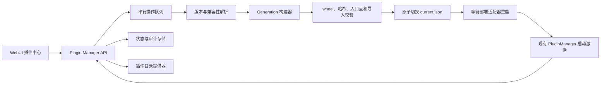

# 可视化插件中心开发方案

> 状态：已完成（M1、M2、M3、M4）  
> 目标版本：下一阶段 / `0.2.x`  
> 适用范围：采集器插件，以及后续处理器、存储器和其他平台扩展  
> 前置成果：采集器已经拆分为独立 Python distribution，并通过
> `gamedata_autoflux.plugins` entry point 在服务启动时发现和激活

实施进度（2026-07-21）：

- [x] M1：只读盘点 API、插件中心页面、来源分类、双语帮助与浏览器验收；
- [x] M2：托管 generation、状态存储、操作队列、官方目录和 wheel 安装；
- [x] M3：启停、升级、卸载、依赖保护和回滚；
- [x] M4：兼容性、安全加固、发布流程和完整端到端覆盖。

M2 验收记录（2026-07-21）：

- core-only 环境可从官方目录安装单个 YouTube 插件，也可上传合法 wheel；
- 安装过程使用持久化串行操作队列，构建不可变 generation，并原子切换 `current.json`；
- 重启前 UI 显示“未加载 / 等待重启”，重启后只激活 `youtube_profiles` 和
  `youtube_comments`，状态收敛为“运行中”；
- 操作历史、目录已安装状态和托管插件记录可跨重启恢复；
- 浏览器完成中英文页面、重启横幅、无横向溢出和控制台零错误验证；
- 官方目录安装、本地 wheel、安全校验、冲突操作、失败恢复和 generation 切换均有自动化覆盖。

M3 验收记录（2026-07-21）：

- 托管插件支持期望启用/禁用，禁用前当前任务不受影响，重启后不再导入 entry point；
- 官方目录插件支持升级并保留期望状态，升级继续复用全量 generation 构建与导入校验；
- 卸载要求插件已经禁用且完成重启，并在提交和执行前双重扫描 Pipeline、DAG、Cron
  与未完成任务引用；
- 最后一个插件可安全卸载到空 generation，历史数据和配置不会被静默删除；
- 可原子回滚到上一保留 generation，失败时恢复原指针，回滚后明确要求重启；
- `ManualRestartController` 提供部署者可执行的重启说明，Web 进程不会自行终止；
- 浏览器端到端验证覆盖禁用/重启、引用保护、卸载、回滚、再次激活、中英文、
  720px 窄屏与控制台零错误；全量回归为 1095 通过、2 跳过。

M4 验收记录（2026-07-21）：

- 目录和本地 wheel 均检查插件 API、核心/Python 版本、操作系统、wheel tag 与运行能力；
  Playwright Chromium 通过隔离子进程探测，并支持部署镜像显式声明或禁用能力；
- `AUTOFLUX_PLUGIN_MANAGER_MODE=read_only`、不可写目录与多工作进程均降级为只读，
  查询仍可用，所有变更返回稳定的 `PLUGIN_ENV_READ_ONLY`，且不会创建或改写 generation；
- wheel 检查覆盖 200 MiB 上传限制、解压总量、成员数量、异常压缩比、重复/碰撞路径、
  路径穿越、符号链接、加密成员、元数据大小、entry point 语法和 SHA-256 完整性；
- 哈希错误、依赖冲突和子进程导入失败均发生在原子切换之前，自动化测试确认
  `current.json` 保持不变；远程目录下载入口本阶段保持关闭，不接受任意主机 URL；
- 官方目录补齐兼容范围、主页、MIT 许可证和图标；9 个第一方/内部包可由发布检查脚本
  构建为 wheel，并生成全部 SHA-256 有效的发布清单，CI 同步校验元数据；
- 浏览器在强制只读且缺少 Chromium 的隔离实例中验证 8 个目录项、5 个不兼容项、
  中英文文案、720px 窄屏、禁用态视觉与控制台零错误；验收后服务已关闭；
- 最终全量回归为 1107 通过、2 跳过，前端生产构建、插件中心 selftest、帮助内容
  selftest、Ruff 和发布构建全部通过。

工作区复查记录（2026-07-26）：

- 全量非集成回归更新为 1142 通过、2 跳过；
- 核心 wheel 与 9 个第一方/内部插件 wheel 均完成实际构建；
- 前端生产构建、插件中心及三组帮助/导览 selftest、全源码编译和 Ruff 均通过。

## 1. 背景

当前版本已经完成运行时插件化，但插件生命周期仍由部署者在 WebUI 之外管理：

- 安装、升级和卸载通过 `pip` 或 Docker 构建参数完成；
- 插件只在服务启动时发现，变更后需要重启；
- `GET /api/plugins` 只返回本次启动的激活结果；
- WebUI 只消费插件注册后的组件，没有独立的插件管理页面；
- 核心尚未持久化“已安装、期望启用、当前激活、等待重启”等状态；
- 当前进程无法可靠地卸载已经导入的 Python 模块。

下一阶段要在现有插件引擎之上增加“插件中心”，让部署者能够在一个可审计、可回滚的流程中查看、安装、启停、升级和卸载插件，同时兼容本地部署和容器部署。

## 2. 目标与非目标

### 2.1 目标

1. 在 WebUI 中统一展示可用插件、已安装插件、运行状态和兼容性。
2. 支持从受信任目录安装第一方插件，并为第三方目录预留扩展接口。
3. 支持上传本地 wheel；默认不执行来源不明的源码构建。
4. 支持启用、禁用、升级、卸载和失败回滚。
5. 所有变更使用异步操作记录，能够查看进度、日志和最终结果。
6. 明确区分安装状态、期望状态和当前运行状态。
7. 插件变更默认在重启后生效，WebUI 必须明确显示“等待重启”。
8. 保留现有 `GET /api/plugins` 的兼容性，不影响已有调用者。
9. 为后续处理器、存储器、通知渠道等扩展类型复用同一套管理能力。

### 2.2 本阶段非目标

- 不实现任意 Python 模块的无重启热卸载。
- 不允许浏览器直接执行任意 `pip` 命令或传入任意命令行参数。
- 不默认支持 Git URL、源码包（sdist）或安装脚本。
- 不在本阶段解决多节点集群中插件环境的自动分发。
- 不承诺自动安装 apt、yum 等系统级依赖。
- 不把插件代码视为安全沙箱；安装插件等价于授权其在服务权限下执行代码。

## 3. 核心设计原则

### 3.1 三类状态分离

插件不能只用一个 `state` 字段描述。API 和 UI 至少要分别展示：

| 维度 | 示例值 | 含义 |
|---|---|---|
| `install_state` | `absent`、`installed`、`failed` | 插件包是否存在于托管环境 |
| `desired_state` | `enabled`、`disabled` | 下次启动时是否应加载 |
| `runtime_state` | `active`、`inactive`、`failed`、`not_loaded` | 当前进程中的真实状态 |
| `restart_required` | `true` / `false` | 当前运行状态是否落后于期望状态 |

例如，用户点击“禁用”后，插件在当前进程中可能仍是 `active`，但
`desired_state=disabled` 且 `restart_required=true`。UI 不得把它错误显示为已经停用。

### 3.2 使用托管插件环境，不修改核心解释器

插件中心不直接向 Autoflux 的基础 Python 环境执行 `pip install`。建议在可持久化数据目录下维护独立的插件环境：

```text
data/plugin-manager/
├── state.sqlite3
├── current.json
├── cache/
├── uploads/
└── generations/
    ├── 20260721-001/site-packages/
    └── 20260721-002/site-packages/
```

每次安装、升级或卸载都根据锁定清单构建一个新的 generation。完成校验后，原子更新
`current.json` 指向新 generation；服务重启时只把当前 generation 加入插件发现路径。
旧 generation 暂时保留，可用于失败回滚。

这种方式避免半安装状态，也不会破坏核心环境。它同时适用于 Windows 和 Linux，不依赖符号链接。

### 3.3 默认重启生效

Python 模块导入后可能已经注册类、创建单例、启动后台任务或持有连接。尝试在同一进程内完全卸载并不可靠，因此：

- 安装、升级、卸载、启用和禁用成功后默认标记 `restart_required=true`；
- 当前任务可以继续完成，但不得宣称新插件已经可用；
- 重启后由现有激活事务验证插件，失败时只回滚该插件的注册；
- 自动重启仅通过明确配置的部署适配器提供，不能假设 Web 进程能够安全重启自己。

## 4. 总体架构



建议新增以下模块：

```text
src/plugin_manager/
├── models.py           # 插件、generation 和 operation 模型
├── store.py            # SQLite 状态、锁定清单和审计记录
├── catalog.py          # bundled / remote catalog provider
├── inventory.py        # 托管、外部和开发态插件盘点
├── resolver.py         # 版本、核心 API 和运行能力兼容性
├── environment.py      # generation 构建、切换、清理和回滚
├── operations.py       # 串行异步任务及进度事件
├── package_reader.py   # wheel 元数据和哈希读取，不导入代码
└── restart.py          # 部署适配器接口

src/web/routes/plugin_manager.py
src/web/src/pages/plugins/
```

现有 `src/core/plugin_system.py` 保留运行时激活职责，不负责下载包或调用 `pip`。

## 5. 插件来源与清单

### 5.1 来源类型

| 来源 | 本阶段能力 | 管理方式 |
|---|---|---|
| `managed` | 完整支持 | 插件中心创建的 generation |
| `external` | 只读 | 已安装在基础解释器中的 entry point |
| `development` | 只读 | `AUTOFLUX_PLUGIN_MODULES` 显式加载的源码模块 |
| `bundled_catalog` | 完整支持 | 仓库或官方静态目录中声明的发行包 |
| `wheel_upload` | 受限支持 | 管理员上传 wheel，校验后安装 |
| `remote_catalog` | 后续启用 | 受信任 HTTPS 插件目录 |

外部插件和开发态插件必须在 UI 中显示来源徽标。插件中心不得尝试卸载基础解释器中的包，也不能把源码模块伪装成托管安装。

### 5.2 插件清单

当前 `PluginSpec` 主要服务运行时注册。插件中心还需要无需导入插件代码即可读取的发布清单。建议每个 distribution 包含 `autoflux-plugin.toml`：

```toml
schema_version = 1
id = "official.youtube"
distribution = "autoflux-plugin-youtube"
display_name = "YouTube"
version = "0.1.0"
description = "YouTube 频道、视频与评论采集器"
publisher = "Autoflux"
homepage = "https://example.invalid/autoflux/plugins/youtube"
license = "MIT"

[compatibility]
plugin_api = "1"
core = ">=0.2,<0.3"
python = ">=3.12"
runtime_capabilities = []

[entrypoint]
group = "gamedata_autoflux.plugins"
name = "youtube"

[contributions]
collectors = ["youtube_profiles", "youtube_comments"]
```

浏览器插件可以声明 `runtime_capabilities = ["playwright-chromium"]`。目录信息用于安装前展示；安装后的 wheel 元数据和实际 `PluginSpec` 必须再次交叉校验。

### 5.3 兼容性检查

安装前至少检查：

- 插件 API 版本；
- Autoflux 核心版本范围；
- Python 版本和操作系统；
- wheel 平台标签；
- 所需运行能力，如 Chromium、CDP 或 GPU；
- 与已安装 distribution 的依赖冲突；
- 插件 ID、distribution 名和 entry point 是否与目录一致。

不兼容插件仍可在目录中显示，但安装按钮必须禁用并解释原因。

## 6. 安装与回滚流程

### 6.1 安装

1. 管理 API 校验管理员权限和显式确认字段。
2. 创建 `operation`，返回 `202 Accepted`，所有变更操作进入单一串行队列。
3. 从受信任目录解析精确版本、下载地址和 SHA-256。
4. 下载到 staging；限制包大小、超时和重定向目标。
5. 只读取 wheel 的 metadata 和清单，不在主进程导入插件。
6. 根据新的锁定清单构建完整 generation，调用参数数组形式的
   `python -m pip`，禁止 `shell=True`。
7. 在隔离子进程中执行 entry point、`PluginSpec`、贡献声明和导入 smoke test；设置超时。
8. 校验全部托管插件，而不仅是本次新增插件。
9. 成功后原子切换 `current.json`，保留上一 generation。
10. 写入审计记录并标记 `restart_required=true`。

任何步骤失败都不得切换 current generation，当前服务继续使用原环境。

### 6.2 升级和降级

升级与安装使用同一 generation 流程。默认只允许目录中已发布且兼容的版本。插件详情页可展示版本列表；降级需要额外确认。

### 6.3 禁用

禁用只修改 `desired_state`，不删除插件包。重启时运行时发现器跳过该插件。禁用前应列出引用它的 Pipeline、DAG 和 Cron，但不自动删除用户配置。

### 6.4 卸载

默认按以下顺序执行：

1. 插件已经处于期望禁用状态；
2. 没有正在使用该插件采集器的运行任务；
3. 返回仍引用该插件的 Pipeline、DAG 和 Cron；存在引用时响应 `409 Conflict`；
4. 用户处理引用后，再构建不包含该插件的新 generation；
5. 历史采集数据和报告不随插件卸载而删除。

本阶段不提供跳过依赖检查的强制卸载按钮。

### 6.5 回滚

如果重启后插件激活失败：

- 运行时仍按现有事务隔离失败插件，其他插件继续工作；
- UI 提供“回滚到上一 generation”；
- 回滚操作只切换 generation 指针并再次要求重启；
- 默认保留最近 2 个成功 generation，失败 generation 保留诊断信息后清理。

## 7. 数据模型

### 7.1 PluginRecord

```json
{
  "id": "official.youtube",
  "distribution": "autoflux-plugin-youtube",
  "display_name": "YouTube",
  "installed_version": "0.1.0",
  "latest_version": "0.2.0",
  "source_type": "managed",
  "trust": "official",
  "install_state": "installed",
  "desired_state": "enabled",
  "runtime_state": "active",
  "restart_required": false,
  "collectors": ["youtube_profiles", "youtube_comments"],
  "compatibility": {
    "compatible": true,
    "reasons": []
  },
  "last_error": null
}
```

### 7.2 OperationRecord

```json
{
  "id": "op_01J...",
  "kind": "install",
  "plugin_id": "official.youtube",
  "requested_version": "0.2.0",
  "state": "running",
  "stage": "building_generation",
  "progress": 65,
  "created_at": "2026-07-21T12:00:00Z",
  "started_at": "2026-07-21T12:00:01Z",
  "finished_at": null,
  "error_code": null,
  "error_message": null,
  "restart_required": false
}
```

操作状态固定为 `queued`、`running`、`succeeded`、`failed`、`cancelled`。只有尚未进入 generation 切换阶段的操作可以取消。

## 8. API 设计

所有接口位于 `/api/plugin-manager`，继承现有 `require_admin` 鉴权。变更接口还必须使用 `confirm=true`，并使用服务端允许列表解析包名和版本。

### 8.1 查询接口

| 方法 | 路径 | 用途 |
|---|---|---|
| `GET` | `/plugins` | 合并目录、安装、期望和运行状态 |
| `GET` | `/plugins/{plugin_id}` | 插件详情、贡献、版本和依赖引用 |
| `GET` | `/catalog` | 搜索和分页查询可用插件 |
| `GET` | `/operations` | 查询操作历史和当前队列 |
| `GET` | `/operations/{operation_id}` | 查询进度和脱敏日志 |
| `GET` | `/environment` | 当前 generation、部署模式和运行能力 |

现有 `GET /api/plugins` 保持原响应格式，用于运行时诊断；新页面使用新的聚合接口。

### 8.2 变更接口

| 方法 | 路径 | 用途 |
|---|---|---|
| `POST` | `/operations/install` | 从目录安装指定版本 |
| `POST` | `/operations/upload` | 上传 wheel 并创建安装操作 |
| `POST` | `/operations/upgrade` | 升级或显式降级 |
| `POST` | `/operations/uninstall` | 卸载无引用的托管插件 |
| `PUT` | `/plugins/{plugin_id}/desired-state` | 设置 `enabled` / `disabled` |
| `POST` | `/operations/rollback` | 切回上一成功 generation |
| `POST` | `/operations/{operation_id}/cancel` | 取消仍可安全中止的操作 |
| `POST` | `/apply-restart` | 通过已配置部署适配器申请重启 |

所有耗时变更返回 `202` 和 `operation_id`。版本冲突、插件引用或不可写部署分别返回稳定的错误码，例如：

- `PLUGIN_INCOMPATIBLE`
- `PLUGIN_ENV_READ_ONLY`
- `PLUGIN_DEPENDENCY_CONFLICT`
- `PLUGIN_REFERENCED`
- `PLUGIN_OPERATION_BUSY`
- `PLUGIN_PACKAGE_UNTRUSTED`
- `PLUGIN_RESTART_UNAVAILABLE`

## 9. WebUI 设计

导航栏新增“插件中心”，页面包含四个区域：

1. **已安装**：状态、版本、来源、贡献组件、启停、升级、卸载和等待重启提示。
2. **插件目录**：搜索、分类、兼容性过滤、发布者和信任等级。
3. **操作记录**：安装阶段、进度、耗时、脱敏日志和失败建议。
4. **运行环境**：当前 generation、可写状态、Python/核心版本、运行能力和重启方式。

插件详情抽屉展示：

- 描述、版本、发布者、许可证和主页；
- 注册的采集器及其运行要求；
- 需要的凭据和会话能力；
- 当前引用它的 Pipeline、DAG、Cron 和运行任务；
- 安装来源、wheel 哈希和最近一次操作；
- 兼容性或激活失败的完整可操作说明。

UI 行为要求：

- 安装和卸载必须二次确认；
- 非官方插件确认框明确说明“插件可在服务器权限下执行代码”；
- 操作进行时禁用冲突按钮；
- 通过轮询获取操作进度，后续可复用 WebSocket 推送；
- 页面刷新后仍能恢复当前操作状态；
- `restart_required=true` 时显示全局横幅，不只显示在插件卡片内；
- 自动重启不可用时给出与部署模式匹配的命令或说明。

## 10. 部署模式

| 部署模式 | 浏览状态 | 安装 Python wheel | 浏览器/系统依赖 | 自动重启 |
|---|---:|---:|---:|---:|
| 本地 venv，数据目录可写 | 支持 | 支持 | 按能力探测 | 可选本地适配器 |
| Docker，挂载插件数据卷 | 支持 | 支持 | 仅镜像已具备的能力 | Docker 适配器可选 |
| 只读容器或无持久卷 | 支持 | 禁止 | 禁止 | 由部署者处理 |
| 多副本服务 | 支持 | 本阶段禁止 | 不适用 | 后续集中控制面 |

当前 Compose 已挂载 `/app/data`，可将托管插件环境持久化到该卷。浏览器类插件仍可能需要镜像级系统库；目录必须根据运行能力禁用不可能成功的安装，而不是尝试在 Web 请求中执行系统包管理器。

建议部署适配器接口：

```python
class RestartController(Protocol):
    name: str

    def available(self) -> bool: ...
    async def request_restart(self) -> None: ...
```

首批实现 `ManualRestartController`。只有在部署者显式配置后，才启用 systemd、Docker 或其他控制器。

## 11. 安全要求

插件管理属于远程代码安装能力，安全等级高于普通配置编辑：

1. 所有接口使用现有管理员鉴权；非本地访问必须配置 API key。
2. 只允许 HTTPS 受信任目录，默认官方目录允许安装。
3. 目录项必须固定 distribution、版本、下载地址和 SHA-256。
4. 默认只接受 wheel；源码构建和 Git 安装保持关闭。
5. 调用子进程必须使用参数数组，禁止 shell 拼接。
6. 下载限制大小、时间、重定向次数和允许的主机。
7. 上传文件随机重命名并存入 staging，禁止使用客户端路径。
8. operation 日志不得输出索引凭据、URL token、环境变量或 API key。
9. 每次操作记录操作者来源、时间、目标版本、哈希和结果。
10. 插件导入 smoke test 在子进程中执行并设置资源/时间限制；它不是完整安全沙箱。
11. 安装前展示信任等级：`official`、`verified`、`community`、`local`。
12. 本阶段第三方插件默认需要逐次确认，不能静默自动升级。

长期若要运行不受信任插件，应将采集器迁移到独立 Worker 容器或进程，并通过稳定 RPC 协议与核心通信；这不属于本阶段的进程内插件模型。

## 12. 配置草案

```yaml
plugin_manager:
  enabled: true
  mode: auto                 # auto | mutable | read_only
  runtime_dir: data/plugin-manager
  allow_wheel_upload: true
  allow_source_builds: false
  allow_untrusted: false
  allow_prerelease: false
  max_package_mb: 200
  operation_timeout_seconds: 900
  keep_generations: 2
  auto_restart: false
  restart_controller: manual
  catalogs:
    - id: official
      type: bundled
      enabled: true
```

`mode=auto` 根据数据目录可写性和是否为多副本部署选择 `mutable` 或 `read_only`。不能安全判断时必须降级为只读。

## 13. 实施阶段

### M1：只读盘点与页面骨架

- 新增聚合数据模型和 inventory；
- 识别 `managed`、`external`、`development` 来源；
- 增加只读 `/api/plugin-manager/plugins` 和环境接口；
- 新增插件中心页面，展示当前已激活的 8 个第一方插件；
- 保持 `GET /api/plugins` 完全兼容。

验收：现有开发态插件显示为 `development` 且管理按钮禁用，状态与系统诊断一致。

### M2：托管环境与安装操作

- 实现 SQLite store、操作队列和审计记录；
- 实现 generation 构建、原子切换和清理；
- 加入 bundled catalog 和第一方插件清单；
- 支持官方 wheel 安装及本地 wheel 上传；
- UI 展示操作进度和等待重启状态。

验收：core-only 部署可从页面安装 YouTube 插件，重启后只出现 YouTube 的两个采集器。

### M3：生命周期与依赖保护

- 实现启用、禁用、升级、卸载和回滚；
- 扫描 Pipeline、DAG、Cron 和运行任务引用；
- 增加稳定错误码与可操作提示；
- 接入 `ManualRestartController` 和全局重启横幅。

验收：被 Pipeline 引用的插件无法卸载；禁用后重启不再注册其组件；回滚可恢复上一版本。

### M4：兼容性、安全和发布

- 运行能力探测与 Docker 只读降级；
- wheel 哈希、包大小与压缩包安全限制；远程下载入口保持关闭；
- 子进程导入 smoke test；
- 完成中英文文案、帮助内容和浏览器端到端测试；
- 补齐官方插件的清单、图标、版本与发布流程。

验收：不兼容、哈希错误、激活失败、只读部署均不会破坏当前 generation，并在 UI 给出明确原因。

## 14. 测试方案

### 14.1 单元测试

- 清单解析、schema 版本和字段校验；
- 来源分类和多来源重名处理；
- 三类状态合并及 `restart_required` 计算；
- 版本范围、wheel tag 和运行能力判断；
- operation 状态机和串行锁；
- 原子 generation 切换、保留和回滚；
- 日志脱敏和稳定错误码。

### 14.2 API 测试

- 管理员鉴权和显式确认；
- 只读部署拒绝变更；
- 安装返回 `202` 并可轮询到最终状态；
- 冲突操作返回 `409`；
- 有引用的插件不能卸载；
- 现有 `/api/plugins` 响应保持兼容。

### 14.3 集成测试

每个测试使用临时数据目录和临时 generation：

- 从 core-only 启动，安装单个第一方插件后重启验证组件集合；
- 安装损坏 wheel，确认 current generation 不变；
- 升级到导入失败版本，确认其他插件仍能启动；
- 禁用、重启、重新启用和回滚；
- Windows 与 Linux 路径处理；
- Docker 持久卷重建后插件仍存在。

### 14.4 浏览器测试

- 搜索、过滤、详情抽屉和空状态；
- 安装确认、进度刷新、失败提示和日志查看；
- 等待重启横幅与重启后状态收敛；
- 禁用冲突按钮和依赖引用列表；
- 中英文与窄屏布局；
- 浏览器控制台零未处理异常。

## 15. 完成标准

本阶段只有同时满足以下条件才算完成：

- 部署者无需进入服务器终端即可安装一个受支持的第一方插件；
- 所有变更可审计、失败不污染当前环境，并至少可回滚一次；
- UI 准确区分已安装、期望启用、当前激活和等待重启；
- 卸载不会静默破坏已有 Pipeline、DAG 或 Cron；
- core-only、单插件和多插件部署均通过自动化测试；
- 不兼容或只读环境只展示可执行的操作；
- Docker 重建后托管插件状态能够通过持久卷恢复；
- 原有插件发现、诊断、任务和组件 API 无回归。

## 16. 后续方向

完成本阶段后，可以继续演进：

- 官方远程插件市场、签名和发布者验证；
- 自动更新策略、更新通道和漏洞公告；
- 独立插件 Worker、资源配额和网络权限；
- 多节点插件分发与滚动重启；
- 插件贡献更多扩展点，包括处理器、存储器、导出器、通知渠道和 UI 扩展；
- 插件开发脚手架、兼容性测试套件和发布 CLI。

在进入第三方开放生态前，应优先完成独立 Worker 和签名验证；进程内 Python 插件只适合受信任代码。
